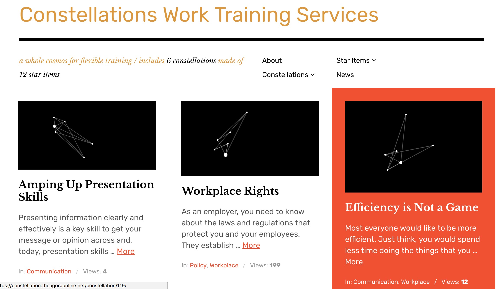

# WP Constellection

by Alan Levine http://cog.dog/ or http://cogdogblog.com/

*WordPress theme for creating constellations to represent collections of web resources*

-----
*If this kind of stuff has any value to you, please consider supporting me so I can do more!*

 

----- 

Child theme of [Rebalance](https://wordpress.com/themes/rebalance/)

Uses [d3js](https://d3js.org)

See the prototype site https://constellation.theagoraonline.net/

Very rough and held together with PHP:ductape

